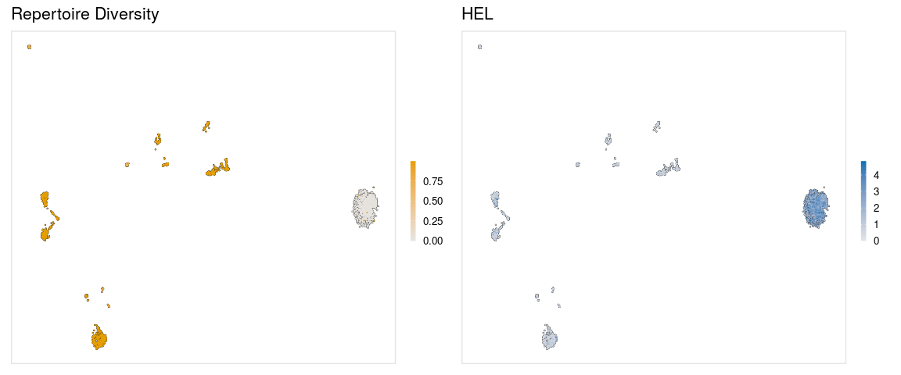
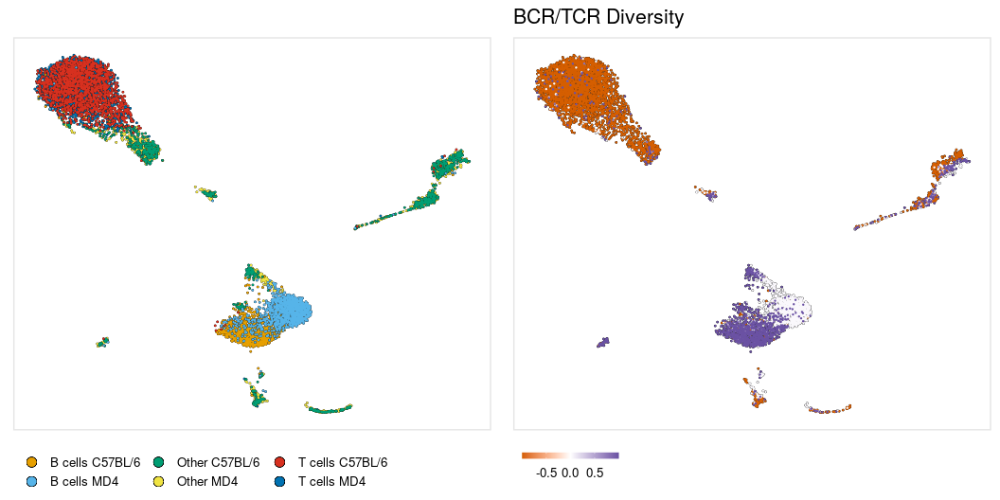

<!-- README.md is generated from README.Rmd. Please edit that file -->

# AVIDtools

<!-- badges: start -->

<!-- badges: end -->

The goal of AVIDtools is to provide tools to analyze AVID-seq signals
alongside single-cell VDJ sequencing data.

<br>

### Installation

You can install the development version of AVIDtools from
[GitHub](https://github.com/rnabioco/AVIDtools) with:

``` r
# install.packages("devtools")
devtools::install_github("rnabioco/AVIDtools")
```

<br>

## Vignette

Splenocytes from MD4 transgenic mice which have monoclonal B cells that
all bind hen egg lysozyme (HEL) antigen were mixed with splenocytes from
C57BL/6 mice at a 1:1 ratio. The cells were stained with the HEL
AVID-tag and sequencing libraries were prepared to capture gene
expression, B/T cell receptor sequences, and AVID-tag signals using the
10x Genomics 5’ immune profiling kit.


<br>

### Import VDJ data

`import_vdj` takes the output files from `cellranger vdj` and adds
clonotype information to the meta.data for an existing Seurat object.
For cells that do not have any VDJ sequencing data, NAs will be included
in the meta.data.

``` r
vdj_dir <- file.path(params$data_dir, "results/JH180_BCR/outs")

so_vdj <- import_vdj(
  sobj_in        = so,       # Seurat object                         
  vdj_dir        = vdj_dir,  # Directory containing cellranger output files
  include_chains = NULL,     # Filter clonotypes that are added based on the given receptor chains
  prefix         = ""        # Prefix to add to new meta.data columns
)

vdj_cols <- c("cdr3s_aa", "n_chains", "clone_freq", "clone_frac")

so_vdj@meta.data %>%
  as_tibble() %>%
  select(orig.ident, nCount_RNA, nFeature_RNA, all_of(vdj_cols))
#> # A tibble: 8,020 x 7
#>    orig.ident nCount_RNA nFeature_RNA cdr3s_aa    n_chains clone_freq clone_frac
#>    <fct>           <dbl>        <int> <chr>          <dbl>      <int>      <dbl>
#>  1 Exp-2             745          470 <NA>              NA         NA  NA       
#>  2 Exp-2             498          271 <NA>              NA         NA  NA       
#>  3 Exp-2             441          219 IGH:CAKGDY…        2          1   0.000358
#>  4 Exp-2             504          264 <NA>              NA         NA  NA       
#>  5 Exp-2             516          306 IGK:CQQYNS…        2          1   0.000358
#>  6 Exp-2             493          263 <NA>              NA         NA  NA       
#>  7 Exp-2             422          292 <NA>              NA         NA  NA       
#>  8 Exp-2             497          297 <NA>              NA         NA  NA       
#>  9 Exp-2             463          264 <NA>              NA         NA  NA       
#> 10 Exp-2             601          327 <NA>              NA         NA  NA       
#> # … with 8,010 more rows
```

<br>

### Filtering

`filter_vdj` allows you to filter a Seurat object using the added
clonotype information or any other columns present in the meta.data. The
terms `.chains` and `.seqs` can be used to filter based on the chains
detected for the cell or the sequence of the chain. Filtering is only
performed on cells that include VDJ data, all other cells will remain in
the object.

Filter to only include cells with both IGH and IGK chains

``` r
so_filt <- filter_vdj(
  sobj_in  = so_vdj,                             # Seurat object
  ...      = all(c("IGH", "IGK") %in% .chains),  # Expression to use for filtering
  cdr3_col = "cdr3s_aa"                          # meta.data column containing CDR3 sequences
)

so_filt@meta.data %>%
  as_tibble() %>%
  filter(!is.na(clonotype_id)) %>%
  select(all_of(vdj_cols))
#> # A tibble: 560 x 4
#>    cdr3s_aa                                       n_chains clone_freq clone_frac
#>    <chr>                                             <dbl>      <int>      <dbl>
#>  1 IGH:CARSYGSSYGYFDVW;IGK:CHQYHRSPPMLTF;IGK:CQH…        3          1   0.000358
#>  2 IGH:CARNYGSSYGFAYW;IGK:CQNDYSYPLTF                    2          1   0.000358
#>  3 IGH:CAGYYGSSYNYW;IGK:CQQDYSSPLTF                      2          1   0.000358
#>  4 IGH:CARELGPLYYYAMDYW;IGK:CQQSNSWPYTF                  2          2   0.000716
#>  5 IGH:CARPYYYGSSYWYFDVW;IGK:CHQYLSSWTF;IGK:CLQY…        3          1   0.000358
#>  6 IGH:CAGDSHGYWYFDVW;IGK:CQQGSSIPLTF                    2          1   0.000358
#>  7 IGH:CTRCRWAWAMDYW;IGK:CLQYDNLWTF                      2          1   0.000358
#>  8 IGH:CARGYSNYAMDYW;IGK:CWQGTHFPLTF                     2          1   0.000358
#>  9 IGH:CARHGSSPHYYAMDYW;IGH:CARESYYYGSSPYAMDYW;I…        4          1   0.000358
#> 10 IGH:CARGVFDYW;IGK:CQNDHSYPYTF;IGK:CLQYASSLTF          3          1   0.000358
#> # … with 550 more rows
```

<br>

Filter for cells with an IGL chain and at least two cells or \>1% that
share the clonotype

``` r
so_filt <- so_vdj %>%
  filter_vdj(.chains == "IGL" && clone_freq > 1 || clone_frac > 0.01)

so_filt@meta.data %>%
  as_tibble() %>%
  filter(!is.na(clonotype_id)) %>%
  select(all_of(vdj_cols))
#> # A tibble: 1,419 x 4
#>    cdr3s_aa        n_chains clone_freq clone_frac
#>    <chr>              <dbl>      <int>      <dbl>
#>  1 IGK:CQQSNSWPYTF        1       1381      0.494
#>  2 IGK:CQQSNSWPYTF        1       1381      0.494
#>  3 IGK:CQQSNSWPYTF        1       1381      0.494
#>  4 IGK:CQQSNSWPYTF        1       1381      0.494
#>  5 IGK:CQQSNSWPYTF        1       1381      0.494
#>  6 IGK:CQQSNSWPYTF        1       1381      0.494
#>  7 IGK:CQQSNSWPYTF        1       1381      0.494
#>  8 IGK:CQQSNSWPYTF        1       1381      0.494
#>  9 IGK:CQQSNSWPYTF        1       1381      0.494
#> 10 IGK:CQQSNSWPYTF        1       1381      0.494
#> # … with 1,409 more rows
```

<br>

Other examples

``` r
# Cells with CDR3 amino acid sequence of 'CQQSNSWPYTF'
so_filt <- so_vdj %>%
  filter_vdj(.seqs == 'CQQSNSWPYTF')

# Cells with IGH, IGK, and IGL chains
so_filt <- so_vdj %>%
  filter_vdj(all(c("IGH", "IGK", "IGL") %in% .chains))

# Cells with two IGK chains and no other chains and >1000 RNA counts
so_filt <- so_vdj %>%
  filter_vdj(all(.chains == "IGK") && n_chains == 2 && nCount_RNA > 1000)

# Cells with at least two unique chains and no IGH chain
so_filt <- so_vdj %>%
  filter_vdj(all(.chains != "IGH") && length(unique(.chains)) > 1)
```

<br>

### Clustering

Cells can be clustered based on the Levenshtein distance between CDR3
sequences using `cluster_vdj`. The `use_chains` argument can be used to
select the chains that should be used when performing distance
calculations.

``` r
so_vdj <- cluster_vdj(
  sobj_in    = so_vdj,            # Seurat object
  cdr3_col   = "cdr3s_aa",        # meta.data column containing CDR3 sequences
  resolution = params$clust_res,  # Clustering resolution
  use_chains = NULL,              # Chains to use for distance calculations
  prefix     = "vdj_"             # Prefix to add to new graph
)
#> Modularity Optimizer version 1.3.0 by Ludo Waltman and Nees Jan van Eck
#> 
#> Number of nodes: 2793
#> Number of edges: 1047168
#> 
#> Running Louvain algorithm...
#> Maximum modularity in 10 random starts: 0.0073
#> Number of communities: 1413
#> Elapsed time: 1 seconds

so_vdj@meta.data %>%
  as_tibble() %>%
  select(all_of(vdj_cols), seurat_clusters)
#> # A tibble: 8,020 x 5
#>    cdr3s_aa                       n_chains clone_freq clone_frac seurat_clusters
#>    <chr>                             <dbl>      <int>      <dbl> <fct>          
#>  1 <NA>                                 NA         NA  NA        <NA>           
#>  2 <NA>                                 NA         NA  NA        <NA>           
#>  3 IGH:CAKGDYGSSWFAYW;IGL:CALWYS…        2          1   0.000358 0              
#>  4 <NA>                                 NA         NA  NA        <NA>           
#>  5 IGK:CQQYNSYPYTF;IGK:CLQHGESPY…        2          1   0.000358 0              
#>  6 <NA>                                 NA         NA  NA        <NA>           
#>  7 <NA>                                 NA         NA  NA        <NA>           
#>  8 <NA>                                 NA         NA  NA        <NA>           
#>  9 <NA>                                 NA         NA  NA        <NA>           
#> 10 <NA>                                 NA         NA  NA        <NA>           
#> # … with 8,010 more rows
```

<br>

The Seurat `RunUMAP` function will not run with the hybrid VDJ object,
but the wrapper function `run_umap_vdj` can be used.

``` r
so_vdj <- run_umap_vdj(
  sobj_in   = so_vdj,      # Seurat object
  umap_key  = "vdjUMAP_",  # Prefix for UMAP columns
  vdj_graph = "vdj_snn"    # Name of VDJ graph to use for UMAP
)
```


<br>

### Repertoire stats

The functions `calc_diversity` and `calc_jaccard` will calculate
repertoire diversity and repertoire overlap on a per-cluster basis.
These functions can be given any meta.data column containing cell labels
to use for calculations.

Calculate repertoire diversity with `calc_diversity`. The inverse
Simpson index is used to measure diversity for each cluster.

``` r
so_vdj <- calc_diversity(
  sobj_in       = so_vdj,             # Seurat object
  clonotype_col = "clonotype_id",     # meta.data column containing clonotype ids
  cluster_col   = "seurat_clusters",  # meta.data column containing cell labels
  prefix        = ""                  # Prefix to add to new meta.data columns
)
```



<br>

Calculate repertoire overlap with `calc_jaccard`. A reference cell label
can be given to calculate Jaccard index for the reference vs all other
cell groups. If no reference is given overlap is calculated for all
combinations of cell labels.

``` r
so_vdj <- calc_jaccard(
  sobj_in       = so_vdj,             # Seurat object
  clonotype_col = "clonotype_id",     # meta.data column containing clonotype ids
  cluster_col   = "seurat_clusters",  # meta.data column containing cell labels
  ref_cluster   = NULL,               # Cell label to use as a reference for Jaccard index
  prefix        = "x"                 # Prefix to add to new meta.data columns 
)
```


<br>

### Combine with TCR data

BCR and TCR data can be added to the same Seurat object

``` r
vdj_dir <- file.path(params$data_dir, "results/JH180_TCR/outs")

so_vdj <- so_vdj %>%
  import_vdj(
    vdj_dir = vdj_dir,
    prefix  = "tcr_"
  ) %>%
  calc_diversity(
    clonotype_col = "tcr_clonotype_id",
    cluster_col   = "RNA_clusters",
    prefix        = "tcr_"
  )
```


