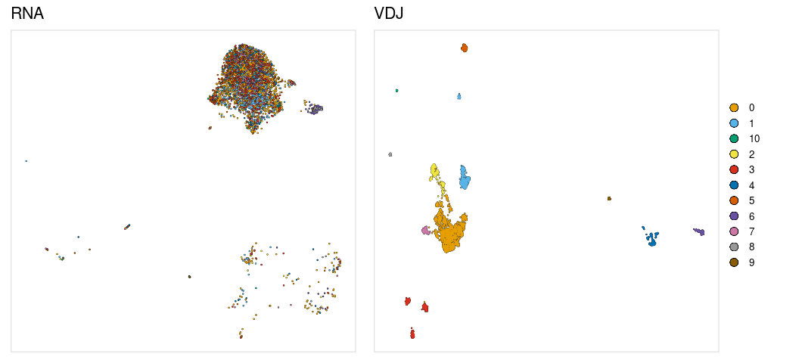

<!-- README.md is generated from README.Rmd. Please edit that file -->

# djvdj 

<!-- badges: start -->

[](https://github.com/rnabioco/djvdj/actions)
<!-- badges: end -->

The goal of djvdj is to provide tools to analyze AVID-seq signals
alongside single-cell VDJ sequencing data.

<br>

### Installation

You can install the development version of djvdj from
[GitHub](https://github.com/rnabioco/djvdj) with:

``` r
# install.packages("devtools")
devtools::install_github("rnabioco/djvdj")
```

<br>

## Vignette

Splenocytes from MD4 transgenic mice which have monoclonal B cells that
all bind hen egg lysozyme (HEL) antigen were mixed with splenocytes from
C57BL/6 mice at a 1:1 ratio. The cells were stained with the HEL
AVID-tag and sequencing libraries were prepared to capture gene
expression, B/T cell receptor sequences, and AVID-tag signals using the
10x Genomics 5’ immune profiling kit.


<br>

### Import VDJ data

`import_vdj` takes the output files from `cellranger vdj` and adds
clonotype information to the meta.data for an existing Seurat object.
For cells that do not have any VDJ sequencing data, NAs will be included
in the meta.data.

``` r
so_vdj <- import_vdj(
  sobj_in        = so,              # Seurat object                         
  vdj_dir        = params$vdj_dir,  # Directory containing cellranger output files
  prefix         = "",              # Prefix to add to new meta.data columns
  cell_prefix    = "",              # Prefix to add to cell barcodes
  filter_contigs = TRUE             # Only include chains with at least one productive contig
)

vdj_cols <- c(
  "chain",      "cdr3",
  "clone_freq", "clone_prop",
   "n_chains"
)

so_vdj@meta.data %>%
  as_tibble() %>%
  select(orig.ident, nCount_RNA, nFeature_RNA, all_of(vdj_cols))
#> # A tibble: 7,137 x 8
#>    orig.ident nCount_RNA nFeature_RNA chain cdr3  clone_freq clone_prop n_chains
#>    <fct>           <dbl>        <int> <chr> <chr>      <int>      <dbl>    <int>
#>  1 AVID-seq          884          551 IGH;… CVKG…          1   0.000262        2
#>  2 AVID-seq         3061          970 <NA>  <NA>          NA  NA              NA
#>  3 AVID-seq         1297          677 IGH;… CARG…          1   0.000262        2
#>  4 AVID-seq         1570          848 <NA>  <NA>          NA  NA              NA
#>  5 AVID-seq         2277          818 <NA>  <NA>          NA  NA              NA
#>  6 AVID-seq         1320          566 <NA>  <NA>          NA  NA              NA
#>  7 AVID-seq          570          348 <NA>  <NA>          NA  NA              NA
#>  8 AVID-seq          909          489 IGH;… CTVS…          1   0.000262        2
#>  9 AVID-seq         1072          588 IGH;… CARS…          1   0.000262        2
#> 10 AVID-seq         1143          594 IGH;… CARS…          1   0.000262        2
#> # … with 7,127 more rows
```

<br>

### Filtering

`filter_vdj` allows you to filter a Seurat object using the added
clonotype information or any other columns present in the meta.data. For
cells with multiple chains, the information for each chain is stored as
a single row, separated by a “;”. When filtering, columns with VDJ data
will be expanded based on the delimiter “;”. The columns that are
expanded for filtering can be specified with the `split_cols` argument.
By default filtering is only performed on cells that include VDJ data.

Filter to only include cells with both IGH and IGK chains

``` r
so_filt <- filter_vdj(
  sobj_in = so_vdj,                           # Seurat object
  filt    = all(c("IGH", "IGK") %in% chain),  # Expression to use for filtering
)

so_filt@meta.data %>%
  as_tibble() %>%
  filter(!is.na(clonotype_id)) %>%
  select(all_of(vdj_cols))
#> # A tibble: 3,174 x 5
#>    chain       cdr3                               clone_freq clone_prop n_chains
#>    <chr>       <chr>                                   <int>      <dbl>    <int>
#>  1 IGH;IGK     CVKGYDYDWYFDVW;CLQYDNLWTF                   1   0.000262        2
#>  2 IGH;IGK     CARGRLGYAMDYW;CQHFWSTPWTF                   1   0.000262        2
#>  3 IGH;IGK     CTVSYTKDWYFDVW;CAQNLELPLTF                  1   0.000262        2
#>  4 IGH;IGK     CARSYDYDPLYYAMDYW;CLQSDNLPLTF               1   0.000262        2
#>  5 IGH;IGK     CARSRLAYW;CLQYASSPFTF                       1   0.000262        2
#>  6 IGH;IGK;IGL CAKRGYSNSLDYW;CQHFWSTPYTF;CALWYSN…          1   0.000262        3
#>  7 IGH;IGK     CANPITTAEGWYFDVW;CLQHGESPYTF                1   0.000262        2
#>  8 IGH;IGK     CARSYGYAMDYW;CWQGTHFPYTF                    1   0.000262        2
#>  9 IGH;IGK     CARWVYGSAWFAYW;CMQHLEYPFTF                  1   0.000262        2
#> 10 IGH;IGK     CARSHGYDFYAMDYW;CQHFWGTPRTF                 1   0.000262        2
#> # … with 3,164 more rows
```

<br>

Filter for cells with an IGL chain and at least two cells or \>1% that
share the clonotype

``` r
so_filt <- so_vdj %>%
  filter_vdj(chain == "IGL" && clone_freq > 1 || clone_prop > 0.01)

so_filt@meta.data %>%
  as_tibble() %>%
  filter(!is.na(clonotype_id)) %>%
  select(all_of(vdj_cols))
#> # A tibble: 133 x 5
#>    chain cdr3        clone_freq clone_prop n_chains
#>    <chr> <chr>            <int>      <dbl>    <int>
#>  1 IGK   CQQSNSWPYTF        121     0.0317        1
#>  2 IGK   CQQSNSWPYTF        121     0.0317        1
#>  3 IGK   CQQSNSWPYTF        121     0.0317        1
#>  4 IGK   CQQSNSWPYTF        121     0.0317        1
#>  5 IGK   CQQSNSWPYTF        121     0.0317        1
#>  6 IGK   CQQSNSWPYTF        121     0.0317        1
#>  7 IGK   CQQSNSWPYTF        121     0.0317        1
#>  8 IGK   CQQSNSWPYTF        121     0.0317        1
#>  9 IGK   CQQSNSWPYTF        121     0.0317        1
#> 10 IGK   CQQSNSWPYTF        121     0.0317        1
#> # … with 123 more rows
```

<br>

Other examples

``` r
# Cells with CDR3 amino acid sequence of 'CQQSNSWPYTF'
so_filt <- so_vdj %>%
  filter_vdj(cdr3 == 'CQQSNSWPYTF')

# Cells with IGH, IGK, and IGL chains
so_filt <- so_vdj %>%
  filter_vdj(all(c("IGH", "IGK", "IGL") %in% chain))

# Cells with two IGK chains and no other chains and >1000 RNA counts
so_filt <- so_vdj %>%
  filter_vdj(all(chain == "IGK") && n_chains == 2 && nCount_RNA > 1000)

# Cells with at least two unique chains and no IGH chain
so_filt <- so_vdj %>%
  filter_vdj(all(chain != "IGH") && length(unique(chain)) > 1)
```

<br>

### Clustering

Cells can be clustered based on the Levenshtein distance between CDR3
sequences using `cluster_vdj`. The `use_chains` argument can be used to
select the chains that should be used when performing distance
calculations.

``` r
so_vdj <- cluster_vdj(
  sobj_in    = so_vdj,            # Seurat object
  cdr3_col   = "cdr3",            # meta.data column containing CDR3 sequences
  resolution = params$clust_res,  # Clustering resolution
  use_chains = NULL,              # Chains to use for distance calculations
  prefix     = "vdj_"             # Prefix to add to new graph
)
#> Modularity Optimizer version 1.3.0 by Ludo Waltman and Nees Jan van Eck
#> 
#> Number of nodes: 3820
#> Number of edges: 148477
#> 
#> Running Louvain algorithm...
#> Maximum modularity in 10 random starts: 0.9451
#> Number of communities: 10
#> Elapsed time: 0 seconds

so_vdj@meta.data %>%
  as_tibble() %>%
  select(all_of(vdj_cols), seurat_clusters)
#> # A tibble: 7,137 x 6
#>    chain   cdr3                   clone_freq clone_prop n_chains seurat_clusters
#>    <chr>   <chr>                       <int>      <dbl>    <int> <fct>          
#>  1 IGH;IGK CVKGYDYDWYFDVW;CLQYDN…          1   0.000262        2 2              
#>  2 <NA>    <NA>                           NA  NA              NA <NA>           
#>  3 IGH;IGK CARGRLGYAMDYW;CQHFWST…          1   0.000262        2 0              
#>  4 <NA>    <NA>                           NA  NA              NA <NA>           
#>  5 <NA>    <NA>                           NA  NA              NA <NA>           
#>  6 <NA>    <NA>                           NA  NA              NA <NA>           
#>  7 <NA>    <NA>                           NA  NA              NA <NA>           
#>  8 IGH;IGK CTVSYTKDWYFDVW;CAQNLE…          1   0.000262        2 0              
#>  9 IGH;IGK CARSYDYDPLYYAMDYW;CLQ…          1   0.000262        2 2              
#> 10 IGH;IGK CARSRLAYW;CLQYASSPFTF           1   0.000262        2 0              
#> # … with 7,127 more rows
```

<br>

The Seurat `RunUMAP` function will not run with the hybrid VDJ object,
but the wrapper function `run_umap_vdj` can be used.

``` r
so_vdj <- run_umap_vdj(
  sobj_in   = so_vdj,      # Seurat object
  umap_key  = "vdjUMAP_",  # Prefix for UMAP columns
  vdj_graph = "vdj_snn"    # Name of VDJ graph to use for UMAP
)
```



<br>

### Repertoire stats

The functions `calc_diversity` and `calc_jaccard` will calculate
repertoire diversity and repertoire overlap on a per-cluster basis.
These functions can be given any meta.data column containing cell labels
to use for calculations.

Calculate repertoire diversity with `calc_diversity`. The inverse
Simpson index is used to measure diversity for each cluster.

``` r
so_vdj <- calc_diversity(
  sobj_in       = so_vdj,          # Seurat object
  clonotype_col = "clonotype_id",  # meta.data column containing clonotype ids
  cluster_col   = "type_mouse",    # meta.data column containing cell labels
  prefix        = ""               # Prefix to add to new meta.data columns
)
```


<br>

Calculate repertoire overlap with `calc_jaccard`. A reference cell label
can be given to calculate Jaccard index for the reference vs all other
cell groups. If no reference is given overlap is calculated for all
combinations of cell labels.

``` r
so_vdj <- calc_jaccard(
  sobj_in       = so_vdj,             # Seurat object
  clonotype_col = "clonotype_id",     # meta.data column containing clonotype ids
  cluster_col   = "seurat_clusters",  # meta.data column containing cell labels
  ref_cluster   = NULL,               # Cell label to use as a reference for Jaccard index
  prefix        = "x"                 # Prefix to add to new meta.data columns 
)
```


