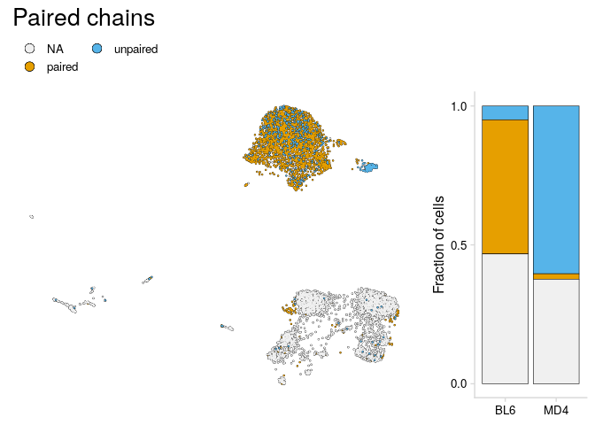

<!-- README.md is generated from README.Rmd. Please edit that file -->

# djvdj 

<!-- badges: start -->

[](https://github.com/rnabioco/djvdj/actions)
<!-- badges: end -->

The goal of djvdj is to provide tools to analyze AVID-seq signals
alongside single-cell VDJ sequencing data.

<br>

## Installation

You can install the development version of djvdj from
[GitHub](https://github.com/rnabioco/djvdj) with:

``` r
# install.packages("devtools")
devtools::install_github("rnabioco/djvdj")
```

<br>

## TCR analysis

Write a description here…

<!-- -->

<br>

### Import VDJ data

`import_vdj` takes the output files from `cellranger vdj` and adds
clonotype information to the meta.data for an existing Seurat object.
For cells with multiple chains, the information for each chain is stored
as a single row, separated by a “;” (or a character specified by `sep`).
For cells that do not have any VDJ sequencing data, NAs will be added to
the meta.data.

If the Seurat object contains data for multiple runs, a vector
containing paths to the VDJ data for each sample can be given. If
multiple paths are provided, cell prefixes should be included as names
for the vector.

``` r
# Create vector of paths for cellranger output
samples <- levels(so_tcr$orig.ident)
paths   <- file.path("data", str_c(samples, "_TCR"))

names(paths) <- str_c(samples, "_GE")

# Import VDJ data
so_tcr <- import_vdj(
  sobj_in         = so_tcr,  # Seurat object
  vdj_dir         = paths,   # Directories containing cellranger output files
  prefix          = "",      # Prefix to add to new meta.data columns
  filter_contigs = TRUE      # Only include chains with at least one productive contig
)

# Take a look at the added meta.data
vdj_cols <- c(
  "clonotype_id", "cdr3",
  "chains", "v_gene", 
  "j_gene", "reads",
  "umis"
)

so_tcr@meta.data %>%
  as_tibble() %>%
  filter(!is.na(clonotype_id)) %>%
  select(all_of(vdj_cols))
#> # A tibble: 3,850 x 7
#>    clonotype_id     cdr3             chains  v_gene      j_gene    reads   umis 
#>    <chr>            <chr>            <chr>   <chr>       <chr>     <chr>   <chr>
#>  1 WT_DN3_GE_clono… CAVQGANTEVFF     TRB     TRBV17      TRBJ1-1   42590   72   
#>  2 WT_DN3_GE_clono… CASSHPGQNSGNTLYF TRB     TRBV5       TRBJ1-3   12670   17   
#>  3 WT_DN3_GE_clono… CASSHWGETLYF     TRB     TRBV5       TRBJ2-3   31772   46   
#>  4 WT_DN3_GE_clono… CGARAQGLYNSPLYF  TRB     TRBV20      TRBJ1-6   7124    15   
#>  5 WT_DN3_GE_clono… CTAPAGGQNTEVFF   TRB     TRBV1       TRBJ1-1   4744    8    
#>  6 WT_DN3_GE_clono… CASSQDLDWGGEQFF  TRB     TRBV5       TRBJ2-1   34966   52   
#>  7 WT_DN3_GE_clono… CASRTGGCYEQYF;C… TRB;TRB TRBV13-1;T… TRBJ2-7;… 4166;6… 7;171
#>  8 WT_DN3_GE_clono… CASSPGTENTLYF    TRB     TRBV12-2    TRBJ2-4   9180    18   
#>  9 WT_DN3_GE_clono… CASSLKGARSDYTF   TRB     TRBV12-1    TRBJ1-2   19742   29   
#> 10 WT_DN3_GE_clono… CASRLTGRDSDYTF;… TRB;TRB TRBV15;TRB… TRBJ1-2;… 28860;… 48;22
#> # … with 3,840 more rows
```

<br>

### Filtering

`filter_vdj` allows you to filter a Seurat object using the added
clonotype information or any other columns present in the meta.data.
When filtering, columns with VDJ data will be expanded based on the
delimiter “;” (or a character passed to `sep`). The columns that are
expanded for filtering can be specified with the `vdj_cols` argument. By
default filtering is only performed on cells that include VDJ data.

Filter to only include cells with paired alpha and beta chains.

``` r
so_filt <- filter_vdj(
  sobj_in  = so_tcr,                            # Seurat object
  filt     = all(c("TRA", "TRB") %in% chains),  # Expression for filtering
  vdj_cols = "chains"
)

# Take a look at the meta.data
so_filt@meta.data %>%
  as_tibble() %>%
  filter(!is.na(clonotype_id)) %>%
  select(all_of(vdj_cols))
#> # A tibble: 654 x 7
#>    clonotype_id    cdr3            chains   v_gene       j_gene    reads   umis 
#>    <chr>           <chr>           <chr>    <chr>        <chr>     <chr>   <chr>
#>  1 WT_DN3_GE_clon… CALSGSNTGYQNFY… TRA;TRB  TRAV15-2-DV… TRAJ49;T… 2286;1… 3;26 
#>  2 WT_DN4_GE_clon… CAASASANKMIF;C… TRA;TRB  TRAV14-2;TR… TRAJ47;T… 19138;… 13;23
#>  3 WT_DN4_GE_clon… CATTGFASALTF;C… TRA;TRB… TRAV16D-DV1… TRAJ35;T… 904;63… 2;6;…
#>  4 WT_DN4_GE_clon… CALGMNYNQGKLIF… TRA;TRB  TRAV6N-7;TR… TRAJ23;T… 8336;8… 8;8  
#>  5 WT_DN4_GE_clon… CALISGSFNKLTF;… TRA;TRB  TRAV12D-2;T… TRAJ4;TR… 2190;8… 1;10 
#>  6 WT_DN4_GE_clon… CAMRGGEGSWQLIF… TRA;TRB  TRAV16N;TRB… TRAJ22;T… 11096;… 8;11 
#>  7 WT_DN4_GE_clon… CAAYNYAQGLTF;C… TRA;TRB  TRAV14N-3;T… TRAJ26;T… 10850;… 7;15 
#>  8 WT_DN4_GE_clon… CALVMNYNQGKLIF… TRA;TRB… TRAV13-1;TR… TRAJ23;T… 16886;… 13;1…
#>  9 WT_DN4_GE_clon… CAVSNNNNAPRF;C… TRA;TRB  TRAV3-3;TRB… TRAJ43;T… 11874;… 8;25 
#> 10 WT_DN4_GE_clon… CAGHYNVLYF;CAS… TRA;TRB  TRAV7-3;TRB… TRAJ21;T… 4144;5… 2;6  
#> # … with 644 more rows
```

<br>

Instead of filtering, `filter_vdj` can also add a new column to the
object meta.data using the `new_col` argument. The values present in
`new_col` will be based on the values (or expression) passed to the
`true` and `false` arguments.

In this example a new column is added indicating whether the cell has a
paired alpha and beta chain. This is useful for generating new cell
labels for plotting.

``` r
so_tcr <- filter_vdj(
  sobj_in = so_tcr,                            # Seurat object
  filt    = all(c("TRA", "TRB") %in% chains),  # Condition to use for filtering
  new_col = "Paired",                          # Name of new column
  true    = "paired",                          # Value when condition is TRUE
  false   = "unpaired"                         # Value when condition is FALSE
)

# Take a look at the meta.data
so_tcr@meta.data %>%
  as_tibble() %>%
  filter(!is.na(clonotype_id)) %>%
  select(all_of(vdj_cols), Paired)
#> # A tibble: 3,850 x 8
#>    clonotype_id    cdr3          chains  v_gene     j_gene   reads  umis  Paired
#>    <chr>           <chr>         <chr>   <chr>      <chr>    <chr>  <chr> <chr> 
#>  1 WT_DN3_GE_clon… CAVQGANTEVFF  TRB     TRBV17     TRBJ1-1  42590  72    unpai…
#>  2 WT_DN3_GE_clon… CASSHPGQNSGN… TRB     TRBV5      TRBJ1-3  12670  17    unpai…
#>  3 WT_DN3_GE_clon… CASSHWGETLYF  TRB     TRBV5      TRBJ2-3  31772  46    unpai…
#>  4 WT_DN3_GE_clon… CGARAQGLYNSP… TRB     TRBV20     TRBJ1-6  7124   15    unpai…
#>  5 WT_DN3_GE_clon… CTAPAGGQNTEV… TRB     TRBV1      TRBJ1-1  4744   8     unpai…
#>  6 WT_DN3_GE_clon… CASSQDLDWGGE… TRB     TRBV5      TRBJ2-1  34966  52    unpai…
#>  7 WT_DN3_GE_clon… CASRTGGCYEQY… TRB;TRB TRBV13-1;… TRBJ2-7… 4166;… 7;171 unpai…
#>  8 WT_DN3_GE_clon… CASSPGTENTLYF TRB     TRBV12-2   TRBJ2-4  9180   18    unpai…
#>  9 WT_DN3_GE_clon… CASSLKGARSDY… TRB     TRBV12-1   TRBJ1-2  19742  29    unpai…
#> 10 WT_DN3_GE_clon… CASRLTGRDSDY… TRB;TRB TRBV15;TR… TRBJ1-2… 28860… 48;22 unpai…
#> # … with 3,840 more rows
```

<!-- -->

<br>

More complicated statements referring to meta.data columns can be used
for the `filt`, `true`, and `false` arguments. For more detailed
analysis of the chains detected for each cell, a new cell label can be
created for only the unique chains detected in each cell.

``` r
so_tcr <- filter_vdj(
  sobj_in = so_tcr,                                # Seurat object
  new_col = "uniq_chains",                         # Name of new column
  true    = str_c(unique(chains), collapse = "_")  # Value when condition is TRUE
)

# Take a look at the meta.data
so_tcr@meta.data %>%
  as_tibble() %>%
  filter(!is.na(clonotype_id)) %>%
  select(all_of(vdj_cols), uniq_chains)
#> # A tibble: 3,850 x 8
#>    clonotype_id    cdr3        chains v_gene   j_gene   reads  umis  uniq_chains
#>    <chr>           <chr>       <chr>  <chr>    <chr>    <chr>  <chr> <chr>      
#>  1 WT_DN3_GE_clon… CAVQGANTEV… TRB    TRBV17   TRBJ1-1  42590  72    TRB        
#>  2 WT_DN3_GE_clon… CASSHPGQNS… TRB    TRBV5    TRBJ1-3  12670  17    TRB        
#>  3 WT_DN3_GE_clon… CASSHWGETL… TRB    TRBV5    TRBJ2-3  31772  46    TRB        
#>  4 WT_DN3_GE_clon… CGARAQGLYN… TRB    TRBV20   TRBJ1-6  7124   15    TRB        
#>  5 WT_DN3_GE_clon… CTAPAGGQNT… TRB    TRBV1    TRBJ1-1  4744   8     TRB        
#>  6 WT_DN3_GE_clon… CASSQDLDWG… TRB    TRBV5    TRBJ2-1  34966  52    TRB        
#>  7 WT_DN3_GE_clon… CASRTGGCYE… TRB;T… TRBV13-… TRBJ2-7… 4166;… 7;171 TRB        
#>  8 WT_DN3_GE_clon… CASSPGTENT… TRB    TRBV12-2 TRBJ2-4  9180   18    TRB        
#>  9 WT_DN3_GE_clon… CASSLKGARS… TRB    TRBV12-1 TRBJ1-2  19742  29    TRB        
#> 10 WT_DN3_GE_clon… CASRLTGRDS… TRB;T… TRBV15;… TRBJ1-2… 28860… 48;22 TRB        
#> # … with 3,840 more rows
```

<!-- -->

<br>

### Clonotype Abundance

To identify the top clonotypes in each sample or cluster, clonotype
abundance can be calculated using the `calc_abundance` function.

``` r
so_tcr <- calc_abundance(
  sobj_in       = so_tcr,        # Seurat object
  clonotype_col = "cdr3",        # meta.data column containing clonotype IDs
  cluster_col   = "orig.ident",  # meta.data column containing cell labels
  prefix        = ""             # Prefix to add to new meta.data columns
)
```

<br>

For each ‘calculation’ function provided by `djvdj`, there is a matching
`plot` function that will generate a summary plot. The `calc_abundance`
function will plot clonotypes ranked by abundance.

``` r
plot_abundance(
  sobj_in       = so_tcr,        # Seurat object
  clonotype_col = "cdr3",        # meta.data column containing clonotype IDs
  cluster_col   = "orig.ident",  # meta.data column containing cell labels
  
  plot_colors = ito_cols,        # Plot colors
  yaxis       = "percent",       # Units to plot
  label_col   = "cdr3",          # meta.data column containing labels
  n_labels    = 1,               # Number of top clonotypes to label
  size        = 1                # Additional ggplot options
) +
  theme(legend.title = element_blank())
```

<!-- -->

<br>

### Repertoire Diversity

The function `calc_diversity` will calculate repertoire diversity on a
per-cluster basis. Using the `cluster_col` argument, any meta.data
column containing cell labels can be used for calculations.
`calc_diversity` uses the R package `abdiv` for performing diversity
calculations and any `abdiv` diversity function can be specified using
the `method` argument.

Possible methods for calculating diversity include:

``` 
 [1] "berger_parker_d"  "brillouin_d"      "dominance"        "heip_e"          
 [5] "invsimpson"       "kempton_taylor_q" "margalef"         "mcintosh_d"      
 [9] "mcintosh_e"       "menhinick"        "pielou_e"         "richness"        
[13] "shannon"          "simpson"          "simpson_e"        "strong"          
```

<br>

In this example we are calculating the Shannon diversity for each sample
in the orig.ident meta.data column.

``` r
so_tcr <- calc_diversity(
  sobj_in       = so_tcr,         # Seurat object
  clonotype_col = "cdr3",         # meta.data column containing clonotype ids
  cluster_col   = "orig.ident",   # meta.data column containing cell labels
  method        = abdiv::shannon  # abdiv method to use
)
```

<br>

The `plot_diversity` function will create plots summarizing repertoire
diversity for each sample. Four different diversity metrics are plotted
below.

``` r
bar_theme <- theme(
  axis.title  = element_blank(),
  axis.text.x = element_text(angle = 45, hjust = 1)
)

# Metrics to use
metrics <- list(
  "simpson"   = abdiv::simpson,
  "shannon"   = abdiv::shannon,
  "margalef"  = abdiv::margalef,
  "menhinick" = abdiv::menhinick
)

# Plot diversity metrics
ggs <- metrics %>%
  imap(~ {
    plot_diversity(
      sobj_in       = so_tcr,        # Seurat object
      clonotype_col = "cdr3",        # meta.data column containing clonotype ids
      cluster_col   = "orig.ident",  # meta.data column containing cell labels
      method        = .x,            # abdiv method to use
      plot_colors   = ito_cols
    ) +
      ggtitle(.y) +
      bar_theme
  })

plot_grid(plotlist = ggs, nrow = 1)
```

<!-- -->

<br>

### Repertoire Overlap

To compare repertoires for different samples or clusters,
`calc_similarity` can calculate a variety of different similarity
metrics. The `cluster_col` should be used to specify the meta.data
column containing cell labels for comparison. Like `calc_diversity`, an
`abdiv` function can be specified with the `method` argument.

Possible methods for calculating repertoire similarity include:

``` 
 [1] "binomial_deviance"                  "bray_curtis"                       
 [3] "bray_curtis_balanced"               "bray_curtis_gradient"              
 [5] "canberra"                           "chebyshev"                         
 [7] "chord"                              "clark_coefficient_of_divergence"   
 [9] "correlation_distance"               "cosine_distance"                   
[11] "cy_dissimilarity"                   "euclidean"                         
[13] "geodesic_metric"                    "hamming"                           
[15] "hellinger"                          "horn_morisita"                     
[17] "jaccard"                            "jaccard_nestedness"                
[19] "jaccard_turnover"                   "kulczynski_first"                  
[21] "kulczynski_second"                  "kullback_leibler_divergence"       
[23] "manhattan"                          "mean_character_difference"         
[25] "minkowski"                          "modified_mean_character_difference"
[27] "morisita"                           "rms_distance"                      
[29] "rogers_tanimoto"                    "russel_rao"                        
[31] "ruzicka"                            "ruzicka_balanced"                  
[33] "ruzicka_gradient"                   "sokal_michener"                    
[35] "sokal_sneath"                       "sorenson"                          
[37] "sorenson_nestedness"                "sorenson_turnover"                 
[39] "weighted_kulczynski_second"         "yule_dissimilarity"                
```

<br>

By default `calc_similarity` will add a new meta.data column for each
comparison. In this example we are calculating the jaccard dissimilarity
index for all combinations of cell labels present in the `orig.ident`
column.

``` r
so_tcr <- calc_similarity(
  sobj_in       = so_tcr,          # Seurat object
  clonotype_col = "cdr3",          # meta.data column containing clonotype ids
  cluster_col   = "orig.ident",    # meta.data column containing cell labels
  method        = abdiv::jaccard,  # abdiv method to use
  prefix        = "jcrd_",         # Prefix to add to new meta.data columns 
  return_seurat = TRUE             # Return Seurat object with results added to meta.data
)
```

<br>

A heatmap summarizing the results can be generated using the
`plot_similarity` function. Here we are creating two heatmaps, one to
compare the different samples and one to compare cell clusters.

``` r
heat_theme <- theme(
  legend.title = element_blank(),
  legend.text  = element_text(size = 8)
)

# Sample heatmap
ident_heat <- plot_similarity(
  sobj_in       = so_tcr,                 # Seurat object
  clonotype_col = "cdr3",                 # meta.data column containing clonotype IDs
  cluster_col   = "orig.ident",           # meta.data column containing cell labels
  method        = abdiv::jaccard,         # Method to use
  plot_colors   = c("grey90", "#009E73")  # Plot colors
) +
  heat_theme

# Cluster heatmap
clust_heat <- plot_similarity(
  sobj_in       = so_tcr,
  clonotype_col = "cdr3",
  cluster_col   = "seurat_clusters",
  method        = abdiv::jaccard,
  plot_colors   = c("grey90", "#56B4E9"),  
  size          = 1,                      # Additional ggplot options
  color         = "white"                 # Additional ggplot options
) +
  heat_theme +
  theme(axis.text.x  = element_text(angle = 0))

# Combine heatmaps
plot_grid(ident_heat, clust_heat, align = "h")
```

<!-- -->

<br>

### Gene Usage

The V(D)J data imported from Cell Ranger also includes the specific
genes detected for each cell. The function `calc_usage` can be used to
calculate the fraction of cells that express different V(D)J genes. This
function will produce a table summarizing the results. To only include
results for a certain chain, the `chain` and `chain_col` arguments can
be used to specify the meta.data column containing the chains detected
for each cell. By default the results for all chains will be included.

In this example we are summarizing the usage of different V genes for
the TRB chain

``` r
calc_usage(
  sobj_in     = so_tcr,        # Seurat object
  gene_cols   = "v_gene",      # meta.data column containing genes
  cluster_col = "orig.ident",  # meta.data column containing cell labels
  chain       = "TRB",         # Chain to use for filtering genes
  chain_col   = "chains"       # meta.data column containing chains identified for each cell
)
#> # A tibble: 92 x 5
#>    v_gene orig.ident n_cells  freq   pct
#>    <chr>  <chr>        <dbl> <int> <dbl>
#>  1 None   WT_DN3         597     0 0    
#>  2 None   WT_DN4         909    12 1.32 
#>  3 None   KI_DN3         728     0 0    
#>  4 None   KI_DN4        1616     8 0.495
#>  5 TRBV1  WT_DN3         597    23 3.85 
#>  6 TRBV1  WT_DN4         909    38 4.18 
#>  7 TRBV1  KI_DN3         728    34 4.67 
#>  8 TRBV1  KI_DN4        1616    66 4.08 
#>  9 TRBV10 WT_DN3         597    31 5.19 
#> 10 TRBV10 WT_DN4         909    59 6.49 
#> # … with 82 more rows
```

<br>

The companion function `plot_usage` can be used to create a heatmap
summarizing these results. Using the `yaxis` argument, the percent or
absolute count (frequency) can be used for plotting. The genes plotting
can also be selected using the `plot_genes` argument, or the total
number of genes to plot can be passed to `n_genes`.

In this example we are only plotting the top 10 genes that have the
highest average usage.

``` r
plot_usage(
  sobj_in     = so_tcr,                  # Seurat object
  gene_cols   = "v_gene",                # meta.data column(s) containing genes
  cluster_col = "orig.ident",            # meta.data column containing cell labels
  chain       = "TRB",                   # Chain to use for filtering genes
  chain_col   = "chains",                # meta.data column containing chains
  
  yaxis       = "percent",               # Units to plot
  plot_colors = c("grey90", "#d7301f"),  # Colors to use for heatmap
  plot_genes  = NULL,                    # A list of genes to plot
  n_genes     = NULL,                    # The number of top genes to plot
  
  size        = 0.2,                     # Additional ggplot options
  color       = "white"                  # Additional ggplot options
) +
  coord_flip()
```

<!-- -->

<br>

By passing multiple columns to `gene_cols`, the frequency that different
genes are used together can also be summarized.

``` r
calc_usage(
  sobj_in     = so_tcr,                 # Seurat object
  gene_cols   = c("v_gene", "j_gene"),  # meta.data column(s) containing genes
  cluster_col = "orig.ident",           # meta.data column containing cell labels
  chain       = "TRB",                  # Chain to use for filtering genes
  chain_col   = "chains"                # meta.data column containing chains
)
```

<br>

When multiple gene columns are passed to `plot_usage`, a list of plots
will be returned, one for each cell label in the `cluster_col` column.

``` r
ggs <- plot_usage(
  sobj_in     = so_tcr,                 # Seurat object
  gene_cols   = c("v_gene", "j_gene"),  # meta.data column(s) containing genes
  cluster_col = "orig.ident",           # meta.data column containing cell labels
  chain       = "TRB",                  # Chain to use for filtering genes
  chain_col   = "chains",               # meta.data column containing chains identified
  plot_colors = c("grey90", "#6A51A3")  # Colors to use for heatmap
) %>%
  imap(~ .x + ggtitle(.y))

plot_grid(plotlist = ggs)
```

<!-- -->
