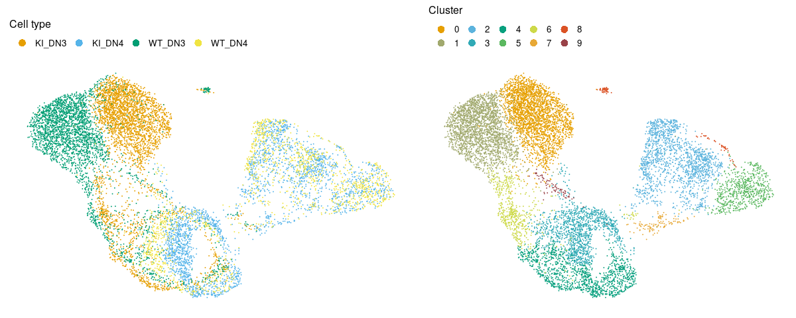
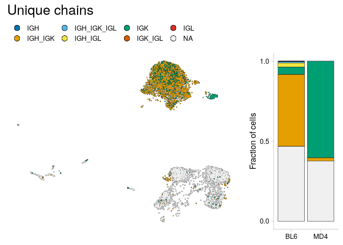
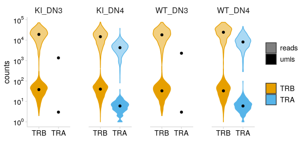
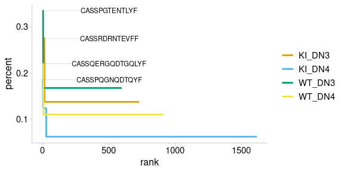
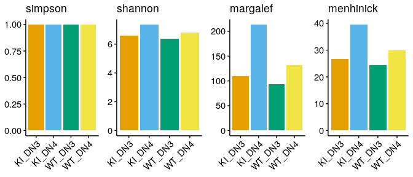
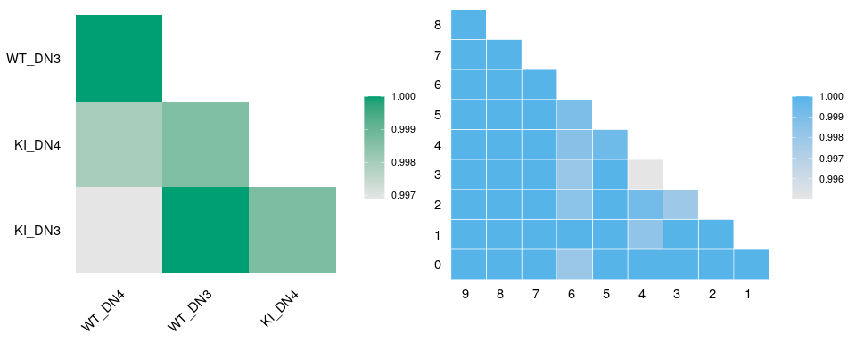
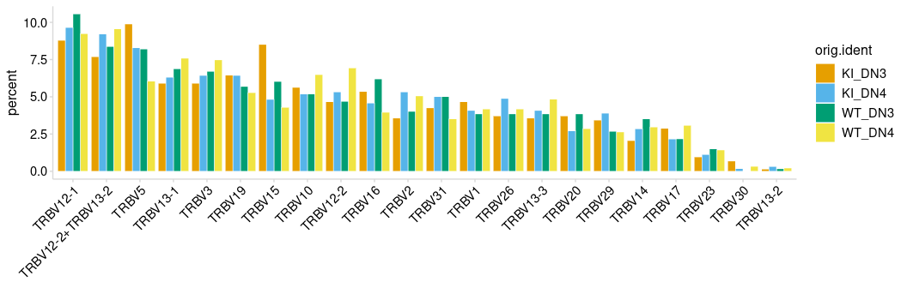
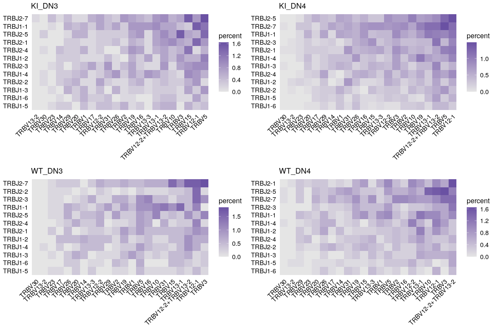

<!-- README.md is generated from README.Rmd. Please edit that file -->

# djvdj 

<!-- badges: start -->

[](https://github.com/rnabioco/djvdj/actions)
<!-- badges: end -->

The goal of djvdj is to provide tools to analyze AVID-seq signals
alongside single-cell VDJ sequencing data.

<br>

## Installation

You can install the development version of djvdj from
[GitHub](https://github.com/rnabioco/djvdj) with:

``` r
# install.packages("devtools")
devtools::install_github("rnabioco/djvdj")
```

<br>

## Vignette

Write a description here…

<!-- -->

<br>

### Import VDJ data

`import_vdj` takes the output files from `cellranger vdj` and adds
clonotype information to the meta.data for an existing Seurat object.
For cells with multiple chains, the information for each chain is stored
as a single row, separated by a “;” (or a character specified by `sep`).
For cells that do not have any VDJ sequencing data, NAs will be added to
the meta.data.

If the Seurat object contains data for multiple runs, a vector
containing paths to the VDJ data for each sample can be given. If
multiple paths are provided, cell prefixes should be included as names
for the vector.

``` r
# Create vector of paths for cellranger output
samples <- levels(so_tcr$orig.ident)
paths   <- file.path("data", str_c(samples, "_TCR"))

names(paths) <- str_c(samples, "_GE")

# Import VDJ data
so_tcr <- import_vdj(
  sobj_in        = so_tcr,  # Seurat object
  vdj_dir        = paths,   # Directories containing cellranger output files
  prefix         = "",      # Prefix to add to new meta.data columns
  filter_contigs = TRUE     # Only include chains with at least one productive contig
)

# Take a look at the meta.data
vdj_cols <- c(
  "clonotype_id", "cdr3",
  "chains", "v_gene", 
  "j_gene", "reads",
  "umis"
)

so_tcr@meta.data %>%
  as_tibble() %>%
  filter(!is.na(clonotype_id)) %>%
  select(all_of(vdj_cols))
#> # A tibble: 3,850 x 7
#>    clonotype_id     cdr3             chains  v_gene      j_gene    reads   umis 
#>    <chr>            <chr>            <chr>   <chr>       <chr>     <chr>   <chr>
#>  1 WT_DN3_GE_clono… CAVQGANTEVFF     TRB     TRBV17      TRBJ1-1   42590   72   
#>  2 WT_DN3_GE_clono… CASSHPGQNSGNTLYF TRB     TRBV5       TRBJ1-3   12670   17   
#>  3 WT_DN3_GE_clono… CASSHWGETLYF     TRB     TRBV5       TRBJ2-3   31772   46   
#>  4 WT_DN3_GE_clono… CGARAQGLYNSPLYF  TRB     TRBV20      TRBJ1-6   7124    15   
#>  5 WT_DN3_GE_clono… CTAPAGGQNTEVFF   TRB     TRBV1       TRBJ1-1   4744    8    
#>  6 WT_DN3_GE_clono… CASSQDLDWGGEQFF  TRB     TRBV5       TRBJ2-1   34966   52   
#>  7 WT_DN3_GE_clono… CASRTGGCYEQYF;C… TRB;TRB TRBV13-1;T… TRBJ2-7;… 4166;6… 7;171
#>  8 WT_DN3_GE_clono… CASSPGTENTLYF    TRB     TRBV12-2    TRBJ2-4   9180    18   
#>  9 WT_DN3_GE_clono… CASSLKGARSDYTF   TRB     TRBV12-1    TRBJ1-2   19742   29   
#> 10 WT_DN3_GE_clono… CASRLTGRDSDYTF;… TRB;TRB TRBV15;TRB… TRBJ1-2;… 28860;… 48;22
#> # … with 3,840 more rows
```

<br>

### Quality Control

#### Paired Chains

The V(D)J data imported from Cell Ranger will include clonotypes that do
not have paired alpha and beta chains. Using the `mutate_vdj` function,
we can add a new cell label to the meta.data to allow for easy
visualization of these cells.

In this example we create a new column that summarizes the unique chains
identified for each cell. We can then overlay these cell labels on a
UMAP projection.

``` r
so_tcr <- mutate_vdj(
  sobj_in     = so_tcr,                                # Seurat object
  uniq_chains = str_c(unique(chains), collapse = "_")  # New column
)

# Take a look at the meta.data
so_tcr@meta.data %>%
  as_tibble() %>%
  filter(!is.na(clonotype_id), n_chains > 2) %>%
  select(all_of(vdj_cols), uniq_chains)
#> # A tibble: 101 x 8
#>    clonotype_id  cdr3       chains  v_gene    j_gene    reads  umis  uniq_chains
#>    <chr>         <chr>      <chr>   <chr>     <chr>     <chr>  <chr> <chr>      
#>  1 WT_DN4_GE_cl… CATTGFASA… TRA;TR… TRAV16D-… TRAJ35;T… 904;6… 2;6;… TRA_TRB    
#>  2 WT_DN4_GE_cl… CALVMNYNQ… TRA;TR… TRAV13-1… TRAJ23;T… 16886… 13;1… TRA_TRB    
#>  3 WT_DN4_GE_cl… CAAYSGGSN… TRA;TR… TRAV14-3… TRAJ53;T… 12106… 14;8… TRA_TRB    
#>  4 WT_DN4_GE_cl… CVVVDLPGT… TRA;TR… TRAV11;T… TRAJ28;T… 6974;… 7;11… TRA_TRB    
#>  5 WT_DN4_GE_cl… CAARRGSNY… TRA;TR… TRAV14D-… TRAJ33;T… 20144… 13;3… TRA_TRB    
#>  6 WT_DN4_GE_cl… CVAHNNAGA… TRA;TR… TRAV11D;… TRAJ39;T… 7230;… 5;10… TRA_TRB    
#>  7 WT_DN4_GE_cl… CAASTSGSW… TRA;TR… TRAV7D-2… TRAJ22;T… 18152… 11;8… TRA_TRB    
#>  8 WT_DN4_GE_cl… CALLASSSF… TRA;TR… TRAV12-1… TRAJ50;T… 12942… 19;5… TRA_TRB    
#>  9 WT_DN4_GE_cl… CAPGTGGYK… TRA;TR… TRAV13-2… TRAJ12;T… 11882… 13;4… TRA_TRB    
#> 10 WT_DN4_GE_cl… CAASALRDS… TRA;TR… TRAV14N-… TRAJ13;T… 13372… 8;15… TRA_TRB    
#> # … with 91 more rows
```

<!-- -->

<br>

Clonotypes that lack paired alpha and beta chains can be removed from
the meta.data using `filter_vdj`. With this function cells that match
the provided condition are filtered from the object. Setting
`filter_cells` to `FALSE` will just remove the V(D)J data without
completely removing these cells.

``` r
so_filt <- filter_vdj(
  sobj_in      = so_tcr,                            # Seurat object
  filt         = all(c("TRA", "TRB") %in% chains),  # Condition for filtering
  filter_cells = FALSE                              # Should cells be removed from object
)

# Take a look at the meta.data
so_filt@meta.data %>%
  as_tibble() %>%
  filter(!is.na(clonotype_id)) %>%
  select(all_of(vdj_cols))
#> # A tibble: 654 x 7
#>    clonotype_id    cdr3            chains   v_gene       j_gene    reads   umis 
#>    <chr>           <chr>           <chr>    <chr>        <chr>     <chr>   <chr>
#>  1 WT_DN3_GE_clon… CALSGSNTGYQNFY… TRA;TRB  TRAV15-2-DV… TRAJ49;T… 2286;1… 3;26 
#>  2 WT_DN4_GE_clon… CAASASANKMIF;C… TRA;TRB  TRAV14-2;TR… TRAJ47;T… 19138;… 13;23
#>  3 WT_DN4_GE_clon… CATTGFASALTF;C… TRA;TRB… TRAV16D-DV1… TRAJ35;T… 904;63… 2;6;…
#>  4 WT_DN4_GE_clon… CALGMNYNQGKLIF… TRA;TRB  TRAV6N-7;TR… TRAJ23;T… 8336;8… 8;8  
#>  5 WT_DN4_GE_clon… CALISGSFNKLTF;… TRA;TRB  TRAV12D-2;T… TRAJ4;TR… 2190;8… 1;10 
#>  6 WT_DN4_GE_clon… CAMRGGEGSWQLIF… TRA;TRB  TRAV16N;TRB… TRAJ22;T… 11096;… 8;11 
#>  7 WT_DN4_GE_clon… CAAYNYAQGLTF;C… TRA;TRB  TRAV14N-3;T… TRAJ26;T… 10850;… 7;15 
#>  8 WT_DN4_GE_clon… CALVMNYNQGKLIF… TRA;TRB… TRAV13-1;TR… TRAJ23;T… 16886;… 13;1…
#>  9 WT_DN4_GE_clon… CAVSNNNNAPRF;C… TRA;TRB  TRAV3-3;TRB… TRAJ43;T… 11874;… 8;25 
#> 10 WT_DN4_GE_clon… CAGHYNVLYF;CAS… TRA;TRB  TRAV7-3;TRB… TRAJ21;T… 4144;5… 2;6  
#> # … with 644 more rows
```

<br>

#### Read Support

The read support for each chain can be visualized with the `plot_reads`
function. This will create plots summarizing the number of UMIs and
total reads that were obtained for each chain.

``` r
plot_reads(
  sobj_in      = so_tcr,        # Seurat object
  chain_col    = "chains",      # Column containing chains for each cell
  cluster_col  = "orig.ident",  # Column containing labels to group by
  plot_colors  = ito_cols       # Plot colors
)
```

<!-- -->

<br>

Clonotypes that do not have adequate UMI support can be filtered from
the object using `filter_vdj`. In this example we filter for clonotypes
that have chains supported by at least two UMIs.

``` r
so_tcr <- filter_vdj(
  sobj_in      = so_tcr,         # Seurat object
  filt         = all(umis > 1),  # Condition for filtering
  filter_cells = FALSE           # Should cells be removed from object
)

# Take a look at the meta.data
so_tcr@meta.data %>%
  as_tibble() %>%
  filter(!is.na(clonotype_id)) %>%
  select(all_of(vdj_cols))
#> # A tibble: 3,807 x 7
#>    clonotype_id     cdr3             chains  v_gene      j_gene    reads   umis 
#>    <chr>            <chr>            <chr>   <chr>       <chr>     <chr>   <chr>
#>  1 WT_DN3_GE_clono… CAVQGANTEVFF     TRB     TRBV17      TRBJ1-1   42590   72   
#>  2 WT_DN3_GE_clono… CASSHPGQNSGNTLYF TRB     TRBV5       TRBJ1-3   12670   17   
#>  3 WT_DN3_GE_clono… CASSHWGETLYF     TRB     TRBV5       TRBJ2-3   31772   46   
#>  4 WT_DN3_GE_clono… CGARAQGLYNSPLYF  TRB     TRBV20      TRBJ1-6   7124    15   
#>  5 WT_DN3_GE_clono… CTAPAGGQNTEVFF   TRB     TRBV1       TRBJ1-1   4744    8    
#>  6 WT_DN3_GE_clono… CASSQDLDWGGEQFF  TRB     TRBV5       TRBJ2-1   34966   52   
#>  7 WT_DN3_GE_clono… CASRTGGCYEQYF;C… TRB;TRB TRBV13-1;T… TRBJ2-7;… 4166;6… 7;171
#>  8 WT_DN3_GE_clono… CASSPGTENTLYF    TRB     TRBV12-2    TRBJ2-4   9180    18   
#>  9 WT_DN3_GE_clono… CASSLKGARSDYTF   TRB     TRBV12-1    TRBJ1-2   19742   29   
#> 10 WT_DN3_GE_clono… CASRLTGRDSDYTF;… TRB;TRB TRBV15;TRB… TRBJ1-2;… 28860;… 48;22
#> # … with 3,797 more rows
```

<br>

### Clonotype Abundance

To identify the top clonotypes in each sample or cluster, clonotype
abundance can be calculated using the `calc_abundance` function.

``` r
so_tcr <- calc_abundance(
  sobj_in       = so_tcr,        # Seurat object
  clonotype_col = "cdr3",        # meta.data column containing clonotype IDs
  cluster_col   = "orig.ident",  # meta.data column containing cell labels
  prefix        = ""             # Prefix to add to new meta.data columns
)
```

<br>

For each ‘calculation’ function provided by `djvdj`, there is a matching
`plot` function that will generate a summary plot. The `calc_abundance`
function will plot clonotypes ranked by abundance.

``` r
plot_abundance(
  sobj_in       = so_tcr,        # Seurat object
  clonotype_col = "cdr3",        # meta.data column containing clonotype IDs
  cluster_col   = "orig.ident",  # meta.data column containing cell labels
  
  plot_colors = ito_cols,        # Plot colors
  yaxis       = "percent",       # Units to plot
  label_col   = "cdr3",          # meta.data column containing labels
  n_labels    = 1,               # Number of top clonotypes to label
  size        = 1                # Additional ggplot options
) +
  theme(legend.title = element_blank())
```

<!-- -->

<br>

### Repertoire Diversity

The function `calc_diversity` will calculate repertoire diversity on a
per-cluster basis. Using the `cluster_col` argument, any meta.data
column containing cell labels can be used for calculations.
`calc_diversity` uses the R package `abdiv` for performing diversity
calculations and any `abdiv` diversity function can be specified using
the `method` argument.

Possible methods for calculating diversity include:

``` 
 [1] "berger_parker_d"  "brillouin_d"      "dominance"        "heip_e"          
 [5] "invsimpson"       "kempton_taylor_q" "margalef"         "mcintosh_d"      
 [9] "mcintosh_e"       "menhinick"        "pielou_e"         "richness"        
[13] "shannon"          "simpson"          "simpson_e"        "strong"          
```

<br>

In this example we are calculating the Shannon diversity for each sample
in the orig.ident meta.data column.

``` r
so_tcr <- calc_diversity(
  sobj_in       = so_tcr,         # Seurat object
  clonotype_col = "cdr3",         # meta.data column containing clonotype ids
  cluster_col   = "orig.ident",   # meta.data column containing cell labels
  method        = abdiv::shannon  # abdiv method to use
)
```

<br>

The `plot_diversity` function will create plots summarizing repertoire
diversity for each sample. Four different diversity metrics are plotted
below.

``` r
bar_theme <- theme(
  axis.title  = element_blank(),
  axis.text.x = element_text(angle = 45, hjust = 1)
)

# Metrics to use
metrics <- list(
  "simpson"   = abdiv::simpson,
  "shannon"   = abdiv::shannon,
  "margalef"  = abdiv::margalef,
  "menhinick" = abdiv::menhinick
)

# Plot diversity metrics
ggs <- metrics %>%
  imap(~ {
    plot_diversity(
      sobj_in       = so_tcr,        # Seurat object
      clonotype_col = "cdr3",        # meta.data column containing clonotype ids
      cluster_col   = "orig.ident",  # meta.data column containing cell labels
      method        = .x,            # abdiv method to use
      plot_colors   = ito_cols
    ) +
      ggtitle(.y) +
      bar_theme
  })

plot_grid(plotlist = ggs, nrow = 1)
```

<!-- -->

<br>

### Repertoire Overlap

To compare repertoires for different samples or clusters,
`calc_similarity` can calculate a variety of different similarity
metrics. The `cluster_col` should be used to specify the meta.data
column containing cell labels for comparison. Like `calc_diversity`, an
`abdiv` function can be specified with the `method` argument.

Possible methods for calculating repertoire similarity include:

``` 
 [1] "binomial_deviance"                  "bray_curtis"                       
 [3] "bray_curtis_balanced"               "bray_curtis_gradient"              
 [5] "canberra"                           "chebyshev"                         
 [7] "chord"                              "clark_coefficient_of_divergence"   
 [9] "correlation_distance"               "cosine_distance"                   
[11] "cy_dissimilarity"                   "euclidean"                         
[13] "geodesic_metric"                    "hamming"                           
[15] "hellinger"                          "horn_morisita"                     
[17] "jaccard"                            "jaccard_nestedness"                
[19] "jaccard_turnover"                   "kulczynski_first"                  
[21] "kulczynski_second"                  "kullback_leibler_divergence"       
[23] "manhattan"                          "mean_character_difference"         
[25] "minkowski"                          "modified_mean_character_difference"
[27] "morisita"                           "rms_distance"                      
[29] "rogers_tanimoto"                    "russel_rao"                        
[31] "ruzicka"                            "ruzicka_balanced"                  
[33] "ruzicka_gradient"                   "sokal_michener"                    
[35] "sokal_sneath"                       "sorenson"                          
[37] "sorenson_nestedness"                "sorenson_turnover"                 
[39] "weighted_kulczynski_second"         "yule_dissimilarity"                
```

<br>

By default `calc_similarity` will add a new meta.data column for each
comparison. In this example we are calculating the jaccard dissimilarity
index for all combinations of cell labels present in the `orig.ident`
column.

``` r
so_tcr <- calc_similarity(
  sobj_in       = so_tcr,          # Seurat object
  clonotype_col = "cdr3",          # meta.data column containing clonotype ids
  cluster_col   = "orig.ident",    # meta.data column containing cell labels
  method        = abdiv::jaccard,  # abdiv method to use
  prefix        = "jcrd_",         # Prefix to add to new meta.data columns 
  return_seurat = TRUE             # Return Seurat object with results added to meta.data
)
```

<br>

A heatmap summarizing the results can be generated using the
`plot_similarity` function. Here we are creating two heatmaps, one to
compare the different samples and one to compare cell clusters.

``` r
heat_theme <- theme(
  legend.title = element_blank(),
  legend.text  = element_text(size = 8)
)

# Sample heatmap
ident_heat <- plot_similarity(
  sobj_in       = so_tcr,                 # Seurat object
  clonotype_col = "cdr3",                 # meta.data column containing clonotype IDs
  cluster_col   = "orig.ident",           # meta.data column containing cell labels
  method        = abdiv::jaccard,         # Method to use
  plot_colors   = c("grey90", "#009E73")  # Plot colors
) +
  heat_theme

# Cluster heatmap
clust_heat <- plot_similarity(
  sobj_in       = so_tcr,
  clonotype_col = "cdr3",
  cluster_col   = "seurat_clusters",
  method        = abdiv::jaccard,
  plot_colors   = c("grey90", "#56B4E9"),  
  size          = 0.2,                    # Additional ggplot options
  color         = "white"                 # Additional ggplot options
) +
  heat_theme +
  theme(axis.text.x  = element_text(angle = 0))

# Combine heatmaps
plot_grid(ident_heat, clust_heat, align = "h")
```

<!-- -->

<br>

### Gene Usage

The V(D)J data imported from Cell Ranger also includes the specific
genes detected for each cell. The function `calc_usage` can be used to
calculate the fraction of cells that express different V(D)J genes. This
function will produce a table summarizing the results. To only include
results for a certain chain, the `chain` and `chain_col` arguments can
be used to specify the meta.data column containing the chains detected
for each cell. By default the results for all chains will be included.

In this example we are summarizing the usage of different V genes for
the TRB chain

``` r
calc_usage(
  sobj_in     = so_tcr,        # Seurat object
  gene_cols   = "v_gene",      # meta.data column containing genes
  cluster_col = "orig.ident",  # meta.data column containing cell labels
  chain       = "TRB",         # Chain to use for filtering genes
  chain_col   = "chains"       # meta.data column containing chains identified for each cell
)
#> # A tibble: 92 x 5
#>    v_gene orig.ident n_cells  freq   pct
#>    <chr>  <chr>        <dbl> <int> <dbl>
#>  1 None   WT_DN3         596     0 0    
#>  2 None   WT_DN4         896    12 1.34 
#>  3 None   KI_DN3         727     0 0    
#>  4 None   KI_DN4        1588     7 0.441
#>  5 TRBV1  WT_DN3         596    23 3.86 
#>  6 TRBV1  WT_DN4         896    37 4.13 
#>  7 TRBV1  KI_DN3         727    34 4.68 
#>  8 TRBV1  KI_DN4        1588    65 4.09 
#>  9 TRBV10 WT_DN3         596    31 5.20 
#> 10 TRBV10 WT_DN4         896    58 6.47 
#> # … with 82 more rows
```

<br>

The function `plot_usage` can be used to summarize these results. Using
the `yaxis` argument, the percent or absolute count (frequency) can be
used for plotting. The genes plotted can also be selected using the
`plot_genes` argument, or the number of top genes (most frequent) to
plot can be specified with `n_genes`.

``` r
plot_usage(
  sobj_in     = so_tcr,                # Seurat object
  gene_cols   = "v_gene",              # meta.data column(s) containing genes
  cluster_col = "orig.ident",          # meta.data column containing cell labels
  type        = "bar",                 # Type of plot
  chain       = "TRB",                 # Chain to use for filtering genes
  chain_col   = "chains",              # meta.data column containing chains
  
  yaxis       = "percent",             # Units to plot
  plot_colors = ito_cols,              # Colors to use for heatmap
  plot_genes  = NULL,                  # A list of genes to plot
  n_genes     = NULL,                  # The number of top genes to plot
  
  size        = 0.2,                   # Additional ggplot options
  color       = "white"                # Additional ggplot options
)
```

<!-- -->

<br>

By passing multiple columns to `gene_cols`, the frequency that different
genes are used together can also be summarized.

``` r
calc_usage(
  sobj_in     = so_tcr,                 # Seurat object
  gene_cols   = c("v_gene", "j_gene"),  # meta.data column(s) containing genes
  cluster_col = "orig.ident",           # meta.data column containing cell labels
  chain       = "TRB",                  # Chain to use for filtering genes
  chain_col   = "chains"                # meta.data column containing chains
)
```

<br>

When multiple gene columns are passed to `plot_usage`, a list of plots
will be returned, one for each cell label in the `cluster_col` column.

``` r
ggs <- plot_usage(
  sobj_in     = so_tcr,                 # Seurat object
  gene_cols   = c("v_gene", "j_gene"),  # meta.data column(s) containing genes
  cluster_col = "orig.ident",           # meta.data column containing cell labels
  chain       = "TRB",                  # Chain to use for filtering genes
  chain_col   = "chains",               # meta.data column containing chains identified
  plot_colors = c("grey90", "#6A51A3")  # Colors to use for heatmap
) %>%
  imap(~ .x + ggtitle(.y))

plot_grid(plotlist = ggs)
```

<!-- -->
